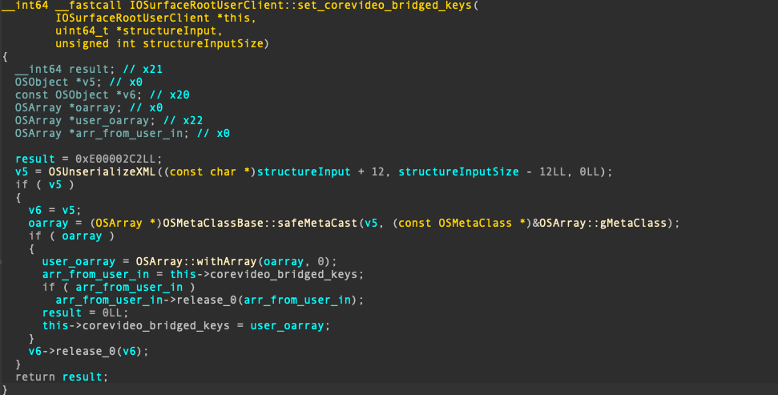

# CVE-2024-44285: IOSurface UaF

This bug was introduced in iOS 18 and it is relatively shallow as it occurs in the second function after the base `s_method` call.  
The vulnerable function lies in `s_set_corevideo_bridged_keys`, which is method #54 on iOS and #57 on macOS.  

A pre-patch version of the vulnerable function can be seen below:

Diffing the two versions shows the patch very clearly:

A lock was missing from the pre-patch version. Calling this method from multiple threads it is possible to over-release an OSArray. (Funnily enough, it seems that that while in the KEXT the locking mechanism was missed, in the userland library this method is correctly called via locks)
